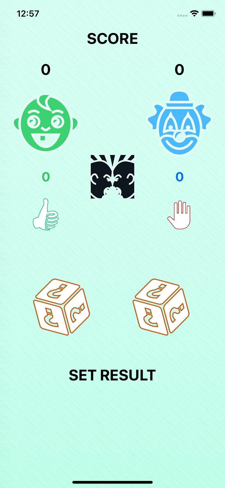
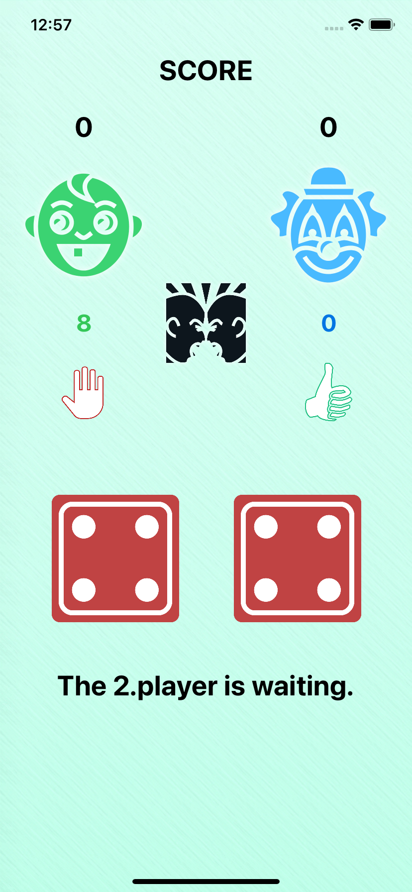
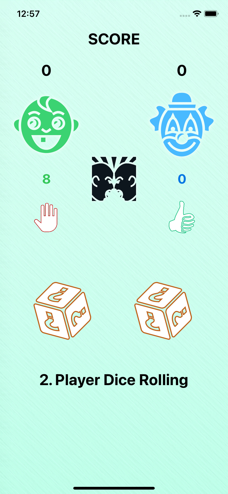

# Dice-Game

Dice Game is a simple dice game played between 2 players using 2 hexahedron dice. There are 5 rounds in total. The point of the person who collects the highest score in each round increases by 1. The one with the highest score in 5 rounds wins.

   
